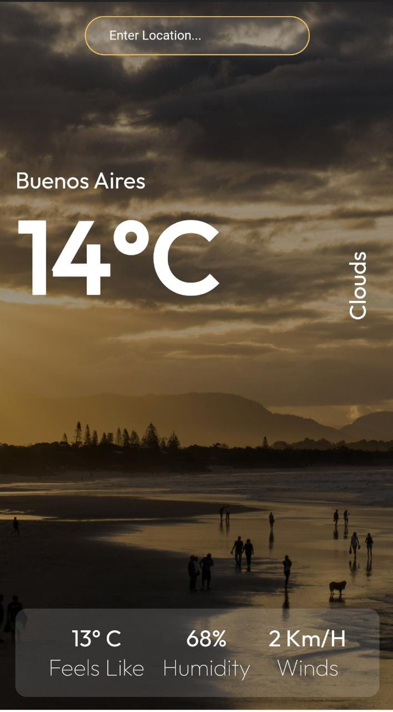
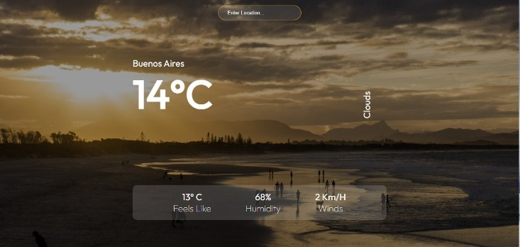

##  <p align="center"> Weather App </p>
<div align="center" >
  
  
</div>

## Sobre el proyecto...

Nuestra App nos permite buscar los datos del clima de una Ciudad en específico, está conectada a una API externa (https://openweathermap.org/api). 
Al ingresar una Ciudad podemos renderizar la siguiente información:

- Nombre de la ciudad ingresada.
- Temperatura.
- Sensación Térmica.
- Humedad
- Vientos.


## Tecnologías utilizadas

- React.Js
- CSS puro.
- axios, para la comunicación con la API
- Vercel, para el deploy

## Setup

Para correr este proyecto localmente:

```
$ cd weather-App
$ npm install
$ npm start
```